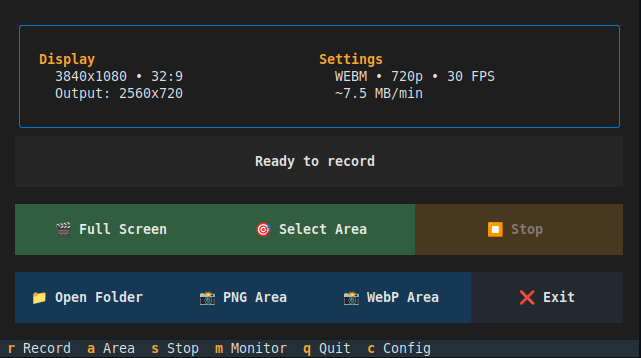

# Recit

> **Rec**ord **it** - A beautiful terminal-based screen recorder for Linux


Recit is a modern, elegant screen recording tool with a beautiful terminal user interface (TUI). Record your screen, capture specific areas, and save screenshots - all from a gorgeous terminal interface powered by [Textual](https://textual.textualize.io/).

## ✨ Features

- 🎬 **Full Screen Recording** - Capture your entire screen
- 🎯 **Area Selection** - Record specific regions with visual selection tool
- 📸 **Screenshots** - Save PNG or WebP screenshots of selected areas
- 🎨 **Beautiful Themes** - 9 Base2Tone color themes + built-in Textual themes
- ⚙️ **Configurable** - Customize format, resolution, framerate via config file
- ⌨️ **Keyboard Shortcuts** - Navigate and control everything from your keyboard
- 💾 **Smart Scaling** - Automatic aspect ratio preservation
- 🖥️ **Monitor Detection** - Automatic monitor resolution detection

## 📸 Screenshot



*Recit's beautiful TUI interface with textual-dark theme*

## 🚀 Installation

### Prerequisites

**System packages:**
```bash
# Debian/Ubuntu/Mint
sudo apt install ffmpeg slop scrot imagemagick

# Fedora
sudo dnf install ffmpeg slop scrot ImageMagick

# Arch Linux
sudo pacman -S ffmpeg slop scrot imagemagick
```

**Python packages:**
```bash
pip install -r requirements.txt
```

### Quick Start

1. Clone the repository:
```bash
git clone https://github.com/yourusername/recit.git
cd recit
```

2. Install dependencies:
```bash
pip install -r requirements.txt
```

3. Make the launcher executable:
```bash
chmod +x recit
```

4. Run Recit:
```bash
./recit
```

### Optional: System-wide Installation

```bash
# Copy to /usr/local/bin
sudo cp recit /usr/local/bin/
sudo cp recit.py /usr/local/bin/
sudo cp monitor_utils.py /usr/local/bin/

# Now run from anywhere
recit
```

## ⌨️ Keyboard Shortcuts

| Key | Action |
|-----|--------|
| `r` | Start full screen recording |
| `a` | Start area selection recording |
| `s` | Stop current recording |
| `m` | Show monitor information |
| `c` | Open configuration menu (change themes) |
| `q` | Quit application |

## ⚙️ Configuration

Recit stores its configuration in `~/.config/recit/config.json`:

```json
{
  "output_dir": "/home/user/Videos/Recordings",
  "format": "webm",
  "framerate": 30,
  "resolution": "720p",
  "quality": "high",
  "hotkey": "ctrl+shift+r",
  "theme": "base2tone-evening"
}
```

### Available Options

- **format**: `webm` or `mp4`
- **framerate**: `15`, `30`, or `60`
- **resolution**: `480p`, `720p`, or `1080p` (full screen only)
- **theme**: See available themes with `c` → Change theme

## 🎨 Themes

Recit includes 9 custom Base2Tone themes plus built-in Textual themes:

**Base2Tone Themes:**
- Evening (purple/orange)
- Sea (teal/orange)
- Forest (green/brown)
- Field (teal/red)
- Desert (beige/brown)
- Drawbridge (blue/orange)
- Earth (brown/orange)
- Lake (blue/orange)
- Meadow (blue/yellow)

**Built-in Themes:**
- textual-dark
- nord
- gruvbox
- dracula
- textual-ansi

Press `c` to open the config menu and change themes on the fly!

## 📁 Project Structure

```
recit/
├── recit           # Launch script
├── recit.py        # Main TUI application
├── monitor_utils.py # Monitor detection utilities
└── requirements.txt # Python dependencies
```

## 🛠️ Technical Details

- **TUI Framework**: [Textual](https://textual.textualize.io/)
- **Video Encoding**: FFmpeg with VP9 codec (WebM)
- **Area Selection**: slop
- **Screenshots**: scrot + ImageMagick
- **Monitor Detection**: xrandr

## 🤝 Contributing

Contributions are welcome! Please feel free to submit a Pull Request.

## 📝 License

MIT License - feel free to use this project however you'd like!

## 🙏 Acknowledgments

- Built with [Textual](https://textual.textualize.io/) by Textualize
- Base2Tone themes by [Bram de Haan](https://base2t.one/)
- Inspired by GNOME Screen Recorder

## 📧 Contact

Created by [@vender3d](https://github.com/vender3d)

---

**Recit** - Record it with style! 🎬
